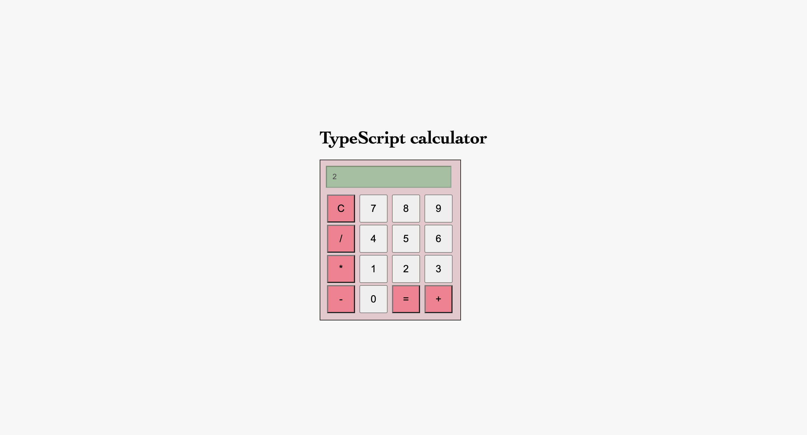

# TypeScript calculator

## Introduction

This is a calculator done on a course called TypeScript in January-February 2024. The first commit includes the base files, HTML, CSS and documentation files that were given in the assignment. The calculator includes the basic operations: addition, substraction, multiplication and division.

## Visuals

## Live page link

Here is the live page link in Netlify: https://main--calculatortypescript.netlify.app/.
